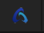
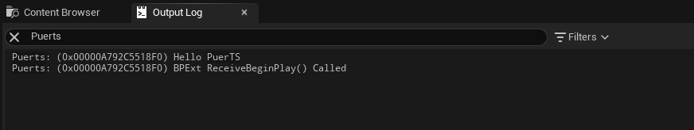
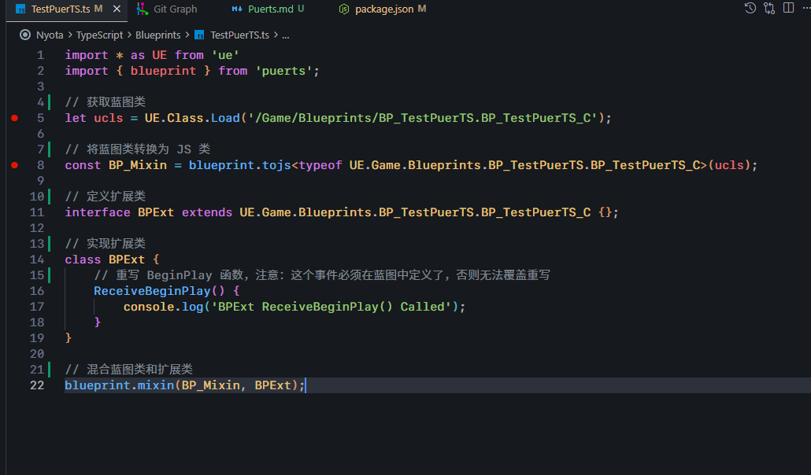
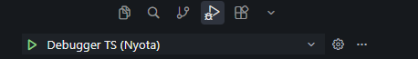

## 安装 NodeJS

- 访问`https://nodejs.org/en/download`下载`LTS`版本安装，并配置到系统`PATH`，参考`https://www.runoob.com/nodejs/nodejs-install-setup.html`


## 配置项目中的 TS 环境

- 命令行进入到项目根目录下面，运行`npm install`，等待安装完成，然后使用`npx tsc -v`命令查看是否安装成功


## 编写 TS 脚本

- 启动`Editor`，在`/Game/Blueprints`路径下（也可以是其他路径下）创建蓝图`BP_TestPuerTS`，然后点击生成对应的`TS`智能提示文件
- 在项目根目录下的`TypeScript`文件夹下面创建脚本文件，命名自己去想，我这边举例子使用`TestPuerTS.ts`，放在了`Blueprints`文件夹下面了，然后里面编写有固定格式，参考[TestPuerTS.ts](../TypeScript/Blueprints/TestPuerTS.ts)，官方文档`https://puerts.github.io/en/docs/puerts/unreal/mixin`
- 写完脚本后，再次命令行进入项目根目录下，运行`npx tsc`或者`npm start`命令将`TS`脚本编译
- 最后打开`Editor`，启动`Game`测试，`console.log`打印的日志都在日志控制台里面：

注意：目前官方建议使用上面(`Mixin`)这种方式去编写`TS`脚本，因为这种方式最稳定，另一种继承引擎类的方式不稳定，Bug较多


## 调试 TS 脚本

### VSCode

- 在`.vscode`文件夹下面的`launch.json`中添加如下内容，这里的端口号要跟`BP_NyotaGameInstance`蓝图中设置的保持一致：
```json
{
    "version": "0.2.0",
    "configurations": [
        {
            "name": "Debugger TS",
            "port": 8889,
            "request": "attach",
            "skipFiles": [
                "<node_internals>/**"
            ],
            "type": "node"
        }
    ]
}
```
- 在`BP_NyotaGameInstance`开启`Enable Debugger`选项
- 在`BP_NyotaGameInstance`开启（可选）`Wait Debugger`（这个开启后启动游戏会阻塞，直到下面使用`VSCode`运行了`Debugger TS`），`Wait Debugger`是为了`Construt`或者`ReceiveBeginPlay`这种启动时执行的函数来用的，如果是触发的`Action`（比如按钮点击事件可以不开启`Wait Debugger`）
- 启动`Editor`，运行`Game`
- 这个时候就可以回到`VSCode`里面使用`Debug`了，添加断点：
- 然后运行`Debugger TS`开始`Debug`：

注意：Debug之前，必须先用`npx tsc`或者`npm start`命令将`TS`脚本编译
